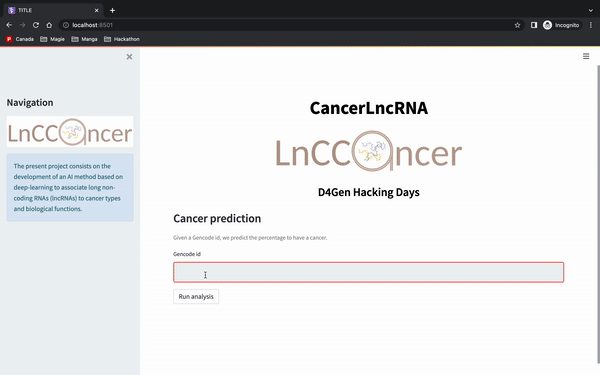

## DL-CancerLncRNA
<p align="center">
<a >
    
</a>
</p>

The present project consists in the development of an AI method based on deep-learning to associate long non-coding RNAs (lncRNAs) to cancer types and biological functions. 

Long non-coding RNAs (**LncRNAs**) are transcripts >200 nt that do not code for proteins. There are ~40 000 - 60 000 lncRNAs in the human genome. However, up to now we only have information for less than 1000. Several of them are implicated in important cell processes and diseases such as cancer.
Experimental characterisation of lncRNAs is a long process. **Bioinformatics approaches are urgently needed** to identify the lncRNAs of interest for **clinical applications**.
Tons of data for their study are already available, and many of them **are public**!
In this project we collected some of the publicly available data such as:
- LncRNAs sequences → https://www.gencodegenes.org/ https://www.ensembl.org/index.html 
- LncRNA expression data across ~1500 samples of cancer → https://dcc.icgc.org/pcawg 
- LncRNAs and cancer associations →  http://www.bio-bigdata.com/lnc2cancer/  https://www.gold-lab.org/clc

The proposed model can be useful to **identity lncRNAs implicated in cancer** for further study and **help to detect new possible therapeutic solutions**. LncRNAs are in fact very promising therapeutic targets because their expression pattern is tissue specific **reducing the risk of off-targets and toxicity in cancer treatments**.
This approach can be explored with other **publicly available** datasets:
- Pan-Cancer Atlas initiative comparing 33 tumor types profiled by TCGA: https://gdc.cancer.gov/about-data/publications/pancanatlas
- The Genotype-Tissue Expression (GTEx) project: https://www.gtexportal.org/home/
- Cancer Cell Line Encyclopedia (CCLE): https://sites.broadinstitute.org/ccle/

## Installation
To install LncCancer, use
```git clone https://github.com/D4GEN-Genopole/DL-CancerLncRNA.git```.
We support Python 3.8 on Linux, macOS and Windows.

## Interface
To launch the API, use the following command : 
```shell
make deploy_api
```
And then you can enter the gene id Ensembl version (e.g. ENSG00000266835), which is then going to return the top 3 cancers that our model predict. 
It will then generate barcharts for either the cancer or the functions associated. 

<p align="center">
<a >
    
</a>
</p>

## Model evaluation
To train and evaluate any of our baselines, or any custom model of your own, use :
```shell
make eval MODEL=<MODEL_NAME> ARGS="<ARG1> <VALUE1> <ARG2> <VALUE2>"
```
where <MODEL_NAME> is the name of the model class to use (a class in the `models` directory). 
To feed parameters to the model, specify them in the `ARGS` parameter string.

It is also possible to use the Docket container. 
To do so, use : 
```shell
make docker 
```

## Data 

### Description

Our dataset was preprocessed to represent well-documented, experimentally validated associations between long non-coding RNAs and various cancers and functions.
We obtained lncRNA / cancer associations from two sources: the recent Cancer LncRNA Census 2 (CLC2) with just over 1.2k associations, and the database Lnc2Cancer with 10k associations.
There were some duplicates in the two databases, which were eliminated. The types of cancer were different: the information from Lnc2Cancer was very specific, which made having enough examples difficult for some classes. We decided to pre-process the different types of cancers in both databases to create a broader, consistent list of 30 cancers (e.g, 'triple-negative breast cancer' was re-classified as 'breast cancer').
Information about the cancer hallmarks of the lncRNAs was also obtained from Lnc2Cancer.

LncRNAs are a complex object of study, therefore we devised two approaches: one based on learning from lncRNA sequences, and the other from expression data. When the information was available, transcript sequences were obtained using the Ensembl bioMart tool, and expression data from the PCGAWG study.

### Visualisation 

We have collected three main datasets : one with the sequences of the RNAs, one with the expressions and the last one with both of them. 

Here is a visualisation of the distribution of the labels : 

| Sequences | Expressions |
|---| --- |
|  |  |


The final dataset with both of the features of the RNA has the following proportion between the different representations : 

<p align="center">
<a >
    
</a>
</p>

To get the plots of the visualisations, use the following command : 

```shell
make viz
```

## Models

We tried different models for both the expressions and sequences data. 

### Expressions models

Expression data is a type of tabular data that is obtained through RNA sequencing. It represents the different expression levels of transcripts for different patients, and is typically normalized to facilitate comparison across samples.

Here, we formatted the expression table so that the lncRNAs are rows for which we want to learn / predict cancer types, and patient samples are the attributes used to describe them. 

The goal here is to see if lncRNAs that have similar expression levels for the same samples are involved in the same cancers, and/or have the same biological functions.

We implemented the following models for expressions data:
- `ExpMLP`: Multi-layer perceptron. We experimented with different hyperparameters such as the number and size of the dense layers, or the dropout rate.
- We also tested classical machine learning algorithms such as `ExpRF` (Random forest) and `ExpKNN` (K-nearest neighbors).

### Sequences models

For the sequences, we only have as inputs a sequence of nucleotides for each lncRNA.

Therefore, models will first have to encode those sequences into vectors, and then use them to predict the different possible cancer types and biological functions.

We implemented the following models for seqences data:
- `KmersMLP`: K-mers encoding, followed by a Multi-layer perceptron classifier.
- `KmersRF` and `KmersKNN`: similarly use K-mers encoding, followed by a Random forest / K-nearest Neighbor classifier.
- `GRUModel`: One-hot encoding, followed by a Gated recurrent unit classifier.
- `EmbeddingCNN1D`: trained Embedding encoding, followed by a 1-D Convolutional classifier.

For the models, we used either pytorch or keras to train the models. 

## Teams 

- TEAM Leader: Constance CREUX - [IBISC](https://www.ibisc.univ-evry.fr/)
- Lilia ESTRADA - [Institut Curie](https://institut-curie.org/)
- Loïc OMNES - [IBISC](https://www.ibisc.univ-evry.fr/)
- Clément BERNARD - [Telecom Paris / Eurecom / Polytechnique Montréal]
