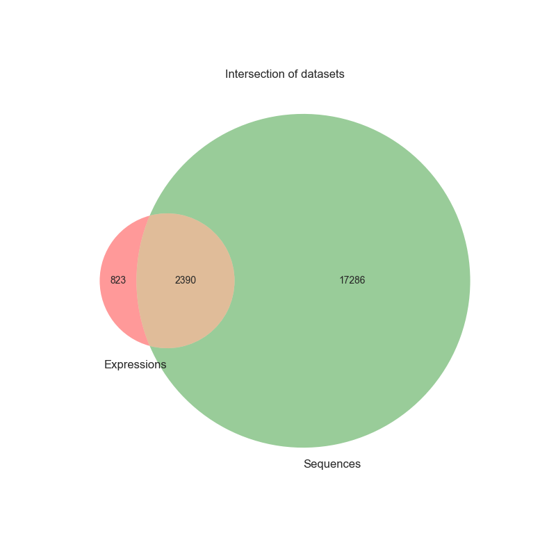

# DL-CancerLncRNA

<p align="center">

<a >
    
</a>

</p>


## Objective
The present project consists on the development of an AI method based on deep-learning to associate long non-coding RNAs (lncRNAs) to cancer types and biological functions. 

Long non-coding RNAs (**LncRNAs**) are transcripts >200 nt that do not code for proteins. There are ~40 000 - 60 000 lncRNAs in the human genome. However, up to now we only have information for much less than 1000. Several of them are implicated in important cell processes and maladies such as cancer.
Experimental characterisation of lncRNAs it’s a long process. **Bioinformatics approaches are urgently needed** to identify the lncRNAs of interest for **clinical applications**.
Tons of data for their study are already available, and many of them **are public**!
In this project we collected some of the publicly available data such as:

- LncRNAs sequences → https://www.gencodegenes.org/ https://www.ensembl.org/index.html 

- LncRNA expression data across ~1500 samples of cancer → https://dcc.icgc.org/pcawg 

- LncRNAs and cancer associations →  http://www.bio-bigdata.com/lnc2cancer/  https://www.gold-lab.org/clc

## Applications
The proposed model can be useful to **identity lncRNAs implicated in cancer** for further study and **help to detect new possible therapeutic solutions**. LncRNAs are in fact very promising therapeutic targets because their expression pattern is tissue specific **reducing the risk of off-targets and toxicity in cancer treatments**.
This approach can be explored with other **publicly available** datasets:
- Pan-Cancer Atlas initiative comparing 33 tumor types profiled by TCGA: https://gdc.cancer.gov/about-data/publications/pancanatlas
- The Genotype-Tissue Expression (GTEx) project: https://www.gtexportal.org/home/
- Cancer Cell Line Encyclopedia (CCLE): https://sites.broadinstitute.org/ccle/

## Installation 

To run the code and do the learning process, one should use the following command : 

```shell
make eval MODEL=<MODEL_NAME> ARGS="ARG1 VALUE1 ARG2 VALUE2"
```
with <MODEL_NAME> the name of the model to use (usually a class in the `models` directory). 
If one wants to add arguments to the model, use it in the `ARGS` parameter.


## Data 

### Description

DESCRIPTION OF THE WAY WE COLLECTED THE DATA 

### Visualisation 

We have collected three main datasets : one with the sequences of the RNAs, one with the expressions and the last one with both of them. 

Here is a visualisation of the distribution of the labels : 

| Sequences | Expressions |
|---| --- |
|  |  |


The final dataset with both of the features of the RNA has the following proportion between the different representations : 

| Sequences and Expressions |
|---| 
|  | 

To get the plots of the visualisations, use the following command : 

```shell
make viz
```


## Teams 

- TEAM Leader: Constance CREUX - [IBISC](https://www.ibisc.univ-evry.fr/)
- Lilia ESTRADA - [Institut Curie](https://institut-curie.org/)
- Loïc OMNES - [IBISC](https://www.ibisc.univ-evry.fr/)
- Clément BERNARD - [Telecom Paris / Eurecom / Polytechnique Montréal]